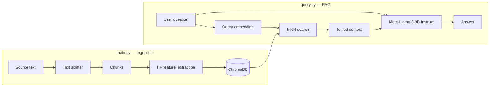
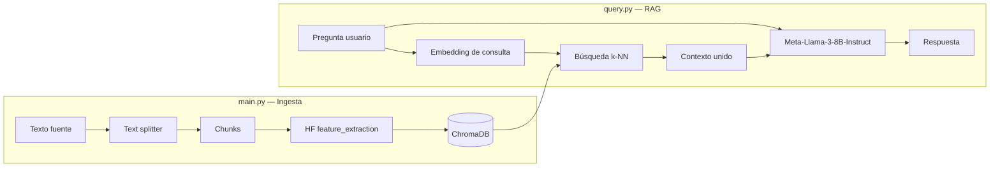

# Lexicon RAG

**[English](#english)** · **[Español](#español)**

---

<a id="english"></a>

## English

A lightweight **Retrieval-Augmented Generation (RAG)** engine built in Python without orchestration frameworks. It covers the full cycle: document chunking, dense embeddings, local vector indexing, and answers grounded in retrieved context.

Suitable as a learning baseline or a starting point to extend ingestion (PDF, Markdown, APIs) and deployment.

### Table of contents

- [Features](#features)
- [Architecture](#architecture)
- [Tech stack](#tech-stack)
- [Requirements](#requirements)
- [Installation](#installation)
- [Configuration](#configuration)
- [Usage](#usage)
- [Project structure](#project-structure)
- [Implementation details](#implementation-details)
- [Limitations & next steps](#limitations--next-steps)
- [License](#license)

---

### Features

| Phase | Script | Description |
|-------|--------|-------------|
| **Ingestion (ETL)** | `main.py` | Splits text into overlapping chunks, generates embeddings via Hugging Face, and persists vectors + metadata in ChromaDB. |
| **Query (RAG)** | `query.py` | Embeds the user question, retrieves the most similar fragments, and generates an answer with an LLM constrained to that context only. |

- **Semantic chunking**: `RecursiveCharacterTextSplitter` (LangChain) with configurable size and overlap.
- **Embeddings**: `sentence-transformers/all-MiniLM-L6-v2` (384 dimensions) via the Hugging Face Inference API.
- **Local storage**: ChromaDB persistent mode (`./chroma_db`), no external database service.
- **Grounded generation**: system prompt that forces the model to use only retrieved context or state that the information is missing.

---

### Architecture



**Two-step workflow**

1. Run `main.py` once (or whenever the corpus changes) to populate the `libro_ia_collection` collection.
2. Run `query.py` to ask questions over the indexed content.

---

### Tech stack

| Component | Technology |
|-----------|------------|
| Language | Python 3.10+ |
| Chunking | `langchain-text-splitters` |
| Embeddings & LLM | `huggingface_hub.InferenceClient` |
| Vector store | ChromaDB (`PersistentClient`) |
| Configuration | `python-dotenv` |

**Models**

| Role | Model |
|------|-------|
| Embeddings | `sentence-transformers/all-MiniLM-L6-v2` |
| Generation | `meta-llama/Meta-Llama-3-8B-Instruct` |

---

### Requirements

- **Python** 3.10 or newer
- **Hugging Face account** with a [fine-grained access token](https://huggingface.co/settings/tokens) that includes **Inference** permissions
- Access to the models above on the Inference API (subject to your account and provider policy)

---

### Installation

```bash
# Clone or enter the project directory
cd lexicon-rag

# Isolated virtual environment
python3 -m venv .venv
source .venv/bin/activate   # macOS / Linux
# .venv\Scripts\activate    # Windows

# Dependencies
pip install -r requirements.txt
```

---

### Configuration

Create a `.env` file at the repository root (listed in `.gitignore`; do not commit it):

```env
HF_TOKEN=your_huggingface_fine_grained_token_here
```

| Variable | Description |
|----------|-------------|
| `HF_TOKEN` | Hugging Face token used by `InferenceClient` for embeddings and chat completions |

---

### Usage

#### 1. Index documents

By default, `main.py` processes sample text embedded in the script. Edit `libro_texto` or replace it with file loading for your use case.

```bash
python main.py
```

Expected output (example):

```text
Generando embeddings para 4 chunks y guardando en ChromaDB...

¡Éxito! Se han guardado 4 elementos en la base de datos vectorial.
```

This creates or updates the `chroma_db/` directory with the persistent collection.

#### 2. Query with RAG

Edit `pregunta_usuario` in `query.py`, or extend the script to accept CLI arguments.

```bash
python query.py
```

The script:

1. Converts the question into a query vector (same embedding model).
2. Retrieves the **2** nearest chunks (`n_results=2`).
3. Sends context + question to the LLM with strict groundedness instructions.

Expected output (structure):

```text
Pregunta: '...'
Transformando la pregunta en un vector de búsqueda...
Buscando en el espacio de fase de ChromaDB...

2. Contexto relevante recuperado de ChromaDB.
3. Enviando pregunta + contexto al LLM generativo en Hugging Face...

🎯 --- Respuesta Final del RAG ---
...
```

> **Run order:** always run `main.py` before `query.py` on a fresh environment. Without indexed chunks, `query.py` will fail when loading the collection.

---

### Project structure

```text
lexicon-rag/
├── main.py              # Ingestion pipeline: chunk → embed → ChromaDB
├── query.py             # RAG pipeline: retrieve → augment → generate
├── requirements.txt     # Project dependencies
├── .env                 # Credentials (local, not versioned)
├── .gitignore
├── chroma_db/           # ChromaDB persistence (runtime, git-ignored)
└── README.md
```

---

### Implementation details

#### Chunking (`main.py`)

```python
RecursiveCharacterTextSplitter(
    chunk_size=150,
    chunk_overlap=30,
    length_function=len,
)
```

- **`chunk_size`**: approximate maximum length per fragment (characters).
- **`chunk_overlap`**: overlap between adjacent chunks to avoid cutting ideas mid-sentence.

#### ChromaDB insertion

Embeddings are collected in lists and inserted in bulk with `collection.add()`, linking each vector to its text and a stable ID (`id_chunk_1`, …).

#### Retrieval (`query.py`)

- **Similarity**: embedding search via `collection.query(query_embeddings=[...], n_results=2)`.
- **Context**: retrieved documents are joined with newlines before injection into the system prompt.
- **Generation**: `client.chat.completions.create()` with `temperature=0.3` and `max_tokens=150` for more deterministic, concise answers.

#### Groundedness

The system prompt requires answering **only** from the `[CONTEXTO]` block. If the information is absent, the model must reply literally: *"No encontré esa información en el documento"* (Spanish in code; you may localize this string).

---

### Limitations & next steps

This repository is an **educational MVP**. Current trade-offs:

| Area | Current state | Possible improvement |
|------|---------------|----------------------|
| Data source | Hardcoded text in `main.py` | Load `.txt`, `.md`, PDF, or URLs |
| Interface | In-code variables | `argparse` / REST API / interactive CLI |
| Collection | Fixed name `libro_ia_collection` | Parameterize collection and path |
| Re-indexing | `add` without prior cleanup | `collection.delete()` or recreate collection on re-ingest |
| Evaluation | Manual | Retrieval metrics (precision@k) and faithfulness |

Production-oriented ideas: reranking, metadata filters, response streaming, observability (log retrieved chunks), and integration tests with mocked Inference API calls.

---

### License

Personal / educational project. Add an explicit license (`MIT`, `Apache-2.0`, etc.) if you plan to distribute it or accept contributions.

**Lexicon RAG** — retrieve → augment → generate from scratch with open-source tools and Hugging Face managed APIs.

---

<a id="español"></a>

## Español

Motor de **Retrieval-Augmented Generation (RAG)** ligero, implementado en Python sin frameworks de orquestación. El proyecto cubre el ciclo completo: fragmentación de documentos, generación de embeddings densos, indexación vectorial local y respuesta condicionada por contexto recuperado.

Ideal como base educativa o punto de partida para extender la ingesta (PDF, Markdown, APIs) y el despliegue.

### Tabla de contenidos

- [Características](#características)
- [Arquitectura](#arquitectura)
- [Stack tecnológico](#stack-tecnológico)
- [Requisitos](#requisitos)
- [Instalación](#instalación)
- [Configuración](#configuración)
- [Uso](#uso)
- [Estructura del proyecto](#estructura-del-proyecto)
- [Detalles de implementación](#detalles-de-implementación)
- [Limitaciones y siguientes pasos](#limitaciones-y-siguientes-pasos)
- [Licencia](#licencia)

---

### Características

| Fase | Script | Descripción |
|------|--------|-------------|
| **Ingesta (ETL)** | `main.py` | Divide texto en chunks con solapamiento, genera embeddings vía Hugging Face y persiste vectores + metadatos en ChromaDB. |
| **Consulta (RAG)** | `query.py` | Embebe la pregunta del usuario, recupera los fragmentos más similares y genera una respuesta con un LLM instruido a usar solo ese contexto. |

- **Chunking semántico**: `RecursiveCharacterTextSplitter` (LangChain) con tamaño y solapamiento configurables.
- **Embeddings**: modelo `sentence-transformers/all-MiniLM-L6-v2` (384 dimensiones) a través de la Inference API de Hugging Face.
- **Almacenamiento local**: ChromaDB en modo persistente (`./chroma_db`), sin servicios externos de base de datos.
- **Generación acotada**: prompt de sistema que obliga al modelo a citar solo el contexto recuperado o declarar que no hay información.

---

### Arquitectura



**Flujo en dos pasos**

1. Ejecutar `main.py` una vez (o cada vez que cambie el corpus) para poblar la colección `libro_ia_collection`.
2. Ejecutar `query.py` para hacer preguntas sobre el contenido indexado.

---

### Stack tecnológico

| Componente | Tecnología |
|------------|------------|
| Lenguaje | Python 3.10+ |
| Fragmentación | `langchain-text-splitters` |
| Embeddings y LLM | `huggingface_hub.InferenceClient` |
| Base vectorial | ChromaDB (`PersistentClient`) |
| Configuración | `python-dotenv` |

**Modelos utilizados**

| Rol | Modelo |
|-----|--------|
| Embeddings | `sentence-transformers/all-MiniLM-L6-v2` |
| Generación | `meta-llama/Meta-Llama-3-8B-Instruct` |

---

### Requisitos

- **Python** 3.10 o superior
- **Cuenta en Hugging Face** con un [token de acceso fine-grained](https://huggingface.co/settings/tokens) que incluya permisos de **Inference**
- Acceso a los modelos anteriores en la Inference API (según la política de tu cuenta y del proveedor)

---

### Instalación

```bash
# Clonar o entrar al directorio del proyecto
cd lexicon-rag

# Entorno virtual aislado
python3 -m venv .venv
source .venv/bin/activate   # macOS / Linux
# .venv\Scripts\activate    # Windows

# Dependencias
pip install -r requirements.txt
```

---

### Configuración

Crea un archivo `.env` en la raíz del repositorio (está en `.gitignore` y no debe subirse a Git):

```env
HF_TOKEN=tu_token_fine_grained_de_huggingface
```

| Variable | Descripción |
|----------|-------------|
| `HF_TOKEN` | Token de Hugging Face usado por `InferenceClient` para embeddings y chat completions |

---

### Uso

#### 1. Indexar documentos

Por defecto, `main.py` procesa un texto de ejemplo incrustado en el script. Ajusta `libro_texto` o sustituye la carga por lectura de archivo según tu caso.

```bash
python main.py
```

Salida esperada (ejemplo):

```text
Generando embeddings para 4 chunks y guardando en ChromaDB...

¡Éxito! Se han guardado 4 elementos en la base de datos vectorial.
```

Se crea o actualiza el directorio `chroma_db/` con la colección persistente.

#### 2. Consultar con RAG

Edita `pregunta_usuario` en `query.py` o extiende el script para aceptar argumentos por CLI.

```bash
python query.py
```

El script:

1. Convierte la pregunta en vector de consulta (mismo modelo de embeddings).
2. Recupera los **2** chunks más cercanos (`n_results=2`).
3. Envía contexto + pregunta al LLM con instrucciones estrictas de groundedness.

Salida esperada (estructura):

```text
Pregunta: '...'
Transformando la pregunta en un vector de búsqueda...
Buscando en el espacio de fase de ChromaDB...

2. Contexto relevante recuperado de ChromaDB.
3. Enviando pregunta + contexto al LLM generativo en Hugging Face...

🎯 --- Respuesta Final del RAG ---
...
```

> **Orden de ejecución:** siempre corre `main.py` antes de `query.py` en un entorno nuevo. Sin chunks indexados, `query.py` fallará al obtener la colección.

---

### Estructura del proyecto

```text
lexicon-rag/
├── main.py              # Pipeline de ingesta: chunk → embed → ChromaDB
├── query.py             # Pipeline RAG: retrieve → augment → generate
├── requirements.txt     # Dependencias del proyecto
├── .env                 # Credenciales (local, no versionado)
├── .gitignore
├── chroma_db/           # Persistencia ChromaDB (generado en runtime, ignorado por Git)
└── README.md
```

---

### Detalles de implementación

#### Chunking (`main.py`)

```python
RecursiveCharacterTextSplitter(
    chunk_size=150,
    chunk_overlap=30,
    length_function=len,
)
```

- **`chunk_size`**: longitud máxima aproximada por fragmento (en caracteres).
- **`chunk_overlap`**: solapamiento entre chunks adyacentes para no cortar ideas a mitad de frase.

#### Inserción en ChromaDB

Los embeddings se acumulan en listas y se insertan en bloque con `collection.add()`, asociando cada vector a su texto y un ID estable (`id_chunk_1`, …).

#### Recuperación (`query.py`)

- **Similitud**: búsqueda por embeddings con `collection.query(query_embeddings=[...], n_results=2)`.
- **Contexto**: los documentos recuperados se unen con saltos de línea antes de inyectarse en el prompt de sistema.
- **Generación**: `client.chat.completions.create()` con `temperature=0.3` y `max_tokens=150` para respuestas más deterministas y breves.

#### Groundedness

El system prompt exige responder **solo** con el bloque `[CONTEXTO]`. Si la información no está presente, el modelo debe responder literalmente: *«No encontré esa información en el documento»*.

---

### Limitaciones y siguientes pasos

Este repositorio es un **MVP educativo**. Convenciones actuales a tener en cuenta:

| Aspecto | Estado actual | Mejora posible |
|---------|---------------|----------------|
| Fuente de datos | Texto hardcodeado en `main.py` | Cargar `.txt`, `.md`, PDF o URLs |
| Interfaz | Variables en código | `argparse` / API REST / CLI interactiva |
| Colección | Nombre fijo `libro_ia_collection` | Parametrizar colección y path |
| Re-indexado | `add` sin borrado previo | `collection.delete()` o recrear colección al re-ingestar |
| Evaluación | Manual | Métricas de retrieval (precision@k) y faithfulness |

Ideas alineadas con un RAG de producción: reranking, filtros de metadatos, streaming de respuestas, observabilidad (logs de chunks recuperados) y tests de integración con mocks de la Inference API.

---

### Licencia

Proyecto personal / educativo. Añade una licencia explícita (`MIT`, `Apache-2.0`, etc.) si planeas distribuirlo o recibir contribuciones.

**Lexicon RAG** — implementación desde cero del patrón retrieve → augment → generate con herramientas open source y APIs gestionadas de Hugging Face.
